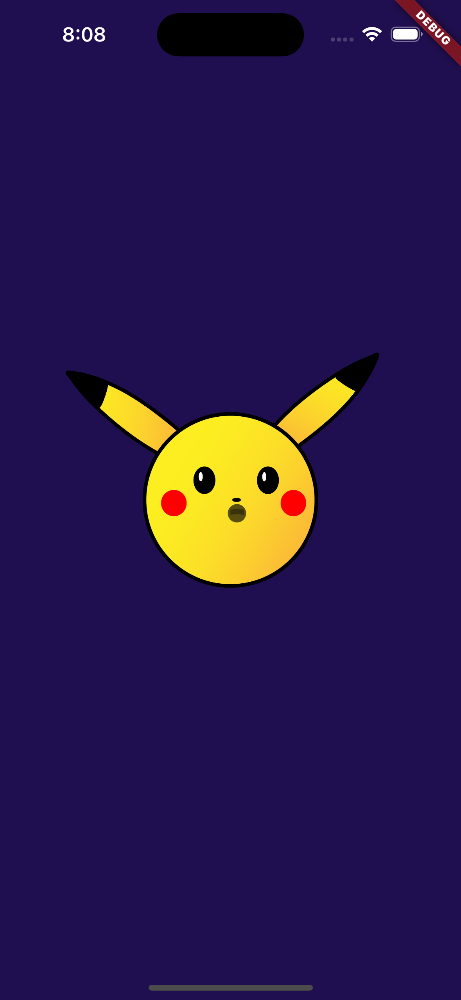
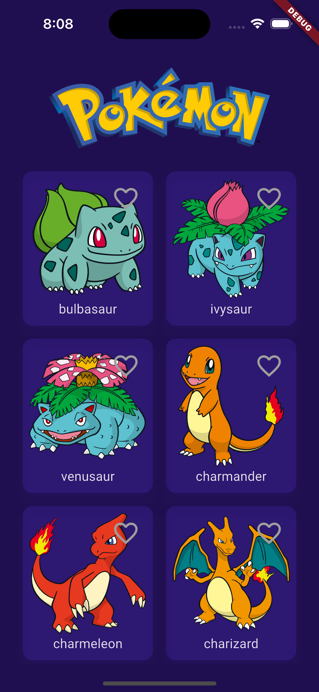
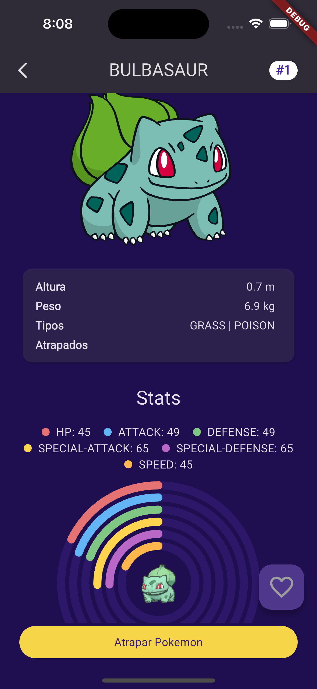
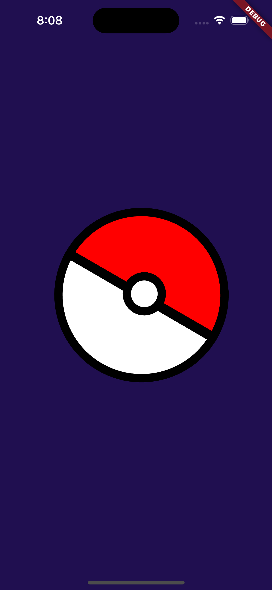

# pokemon

Un proyecto realizado en flutter que expone una propuesta de arquitectura limpia y escalable.

## Requisitos
- Flutter 3.27.1
- Dart 3.6.0

## Instalación
1. Seguir los pasos de instalación de Flutter en https://flutter.dev/docs/get-started/install
2. Ejecutar el comando `flutter doctor` para verificar que todo está correctamente instalado.
3. Ejecutar el comando `flutter --version` para verificar la versión de Flutter y Dart.
4. Todos los valores deben salir en verde y la versión de Flutter y Dart debe ser la misma que se menciona en los requisitos.

## Arquitectura

La arquitectura propuesta es una arquitectura limpia y escalable, la cual se divide en 3 capas principales:
- **Data**: Contiene la lógica de acceso a datos, en este caso, la lógica de acceso a la API de Pokemon.
- **Domain**: Contiene la lógica de negocio, en este caso, la lógica de negocio de la aplicación.
- **Presentation**: Contiene la lógica de presentación, en este caso, la lógica de presentación de la aplicación.

## Diseño 

Diseño de los componentes basados en el tema oscuro de Material 3.
Adaptados al color primario y secundario de la aplicación.

## Estructura del proyecto

La estructura del proyecto es la siguiente:
- **lib**: Contiene el código fuente de la aplicación.
  - **core**: Contiene la lógica común de la aplicación.
    - **config**: Contiene la configuración de la aplicación (navegación).
    - **extensions**: Contiene las extensiones de la aplicación.
    - **network**: Contiene la lógica de red de la aplicación.
    - **resources**: Contiene los recursos de la aplicación.
    - **widgets**: Contiene los widgets comunes de la aplicación.
  - **features**: Contiene las funcionalidades de la aplicación se dividen por modulos.
    - **data**: Contiene la lógica de acceso a datos.
      - **dto**: Contiene los modelos de datos (Data Transfer Model).
      - **repositories**: Contiene las interfaces de los repositorios.
      - **sources**: Contiene las fuentes de datos.
    - **domain**: Contiene la lógica de negocio.
      - **entity**: Contiene los modelos o entidades de negocio.
      - **repositories**: Contiene las interfaces de los repositorios.
      - **usecases**: Contiene los casos de uso.
    - **presentation**: Contiene la lógica de presentación.
      - **notifier**: Contiene los notificadores de cambio de estado.
      - **screens**: Contiene las páginas de la aplicación.
      - **widgets**: Contiene los widgets de la aplicación.
  - **app.dart**: Contiene la aplicación.

## Dependencias
- **dio**: Para realizar peticiones HTTP.
- **provider**: Para la gestión de estados.
- **equatable**: Para la comparación de objetos.
- **go_router**: Para la navegación.
- **lottie**: Para la animación de Lottie.
- **google_fonts**: Para la gestión de fuentes.
- **flutter_svg**: Para la gestión de SVG.
- **uuid**: Para la generación de UUID.

## Uso 
1. Clonar el repositorio con el comando `git clone <URL_REPOSITORIO>`.
2. Abrir el proyecto en un editor de código, por ejemplo, Visual Studio Code.
3. Ejecutar el comando `flutter pub get` para instalar las dependencias.
4. Ejecutar el comando `flutter run` para ejecutar la aplicación en un emulador o dispositivo físico.

## Plataformas
- Android :heavy_check_mark:
- iOS :heavy_check_mark:
- Web :heavy_check_mark:
- Windows :heavy_check_mark:
- MacOS :heavy_check_mark:
- Linux :heavy_check_mark:

## Capturas
<p>
    
    
    
    
</p>

## Video
<video src="resources/video.mp4" width="320" height="200" controls preload></video>

## Tests
En desarrollo. :construction:

## Licencia
Este proyecto está bajo la licencia MIT.
```
Copyright 2025 Richar Cangui
Permission is hereby granted, free of charge, to any person obtaining a copy of this software and associated documentation files (the "Software"), to deal in the Software without restriction, including without limitation the rights to use, copy, modify, merge, publish, distribute, sublicense, and/or sell copies of the Software, and to permit persons to whom the Software is furnished to do so, subject to the following conditions:

The above copyright notice and this permission notice shall be included in all copies or substantial portions of the Software.

THE SOFTWARE IS PROVIDED "AS IS", WITHOUT WARRANTY OF ANY KIND, EXPRESS OR IMPLIED, INCLUDING BUT NOT LIMITED TO THE WARRANTIES OF MERCHANTABILITY, FITNESS FOR A PARTICULAR PURPOSE AND NONINFRINGEMENT. IN NO EVENT SHALL THE AUTHORS OR COPYRIGHT HOLDERS BE LIABLE FOR ANY CLAIM, DAMAGES OR OTHER LIABILITY, WHETHER IN AN ACTION OF CONTRACT, TORT OR OTHERWISE, ARISING FROM, OUT OF OR IN CONNECTION WITH THE SOFTWARE OR THE USE OR OTHER DEALINGS IN THE SOFTWARE.
```

# pokedex
